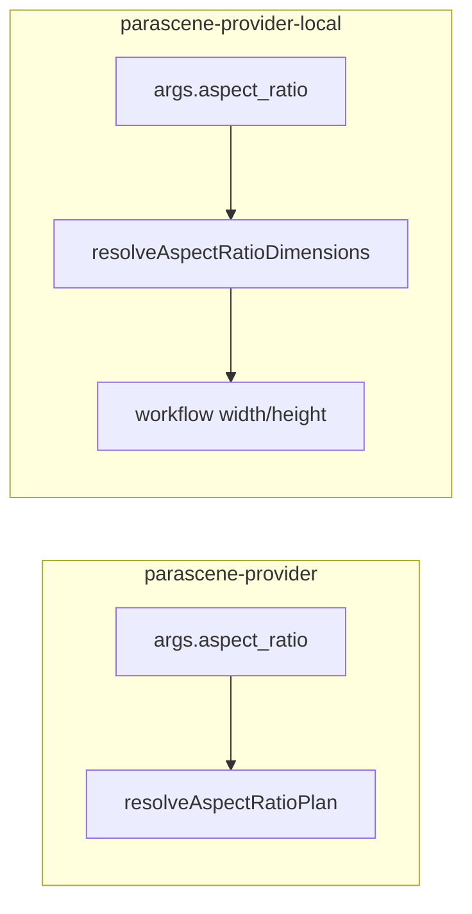

# Aspect ratio support (local Comfy provider)

Plan for adding `aspect_ratio` to parascene-provider-local using the same API shape as [parascene-provider](https://github.com/crosshj/parascene-provider) (`1:1`, `4:5`, `9:16`, `16:9`), mapping ratios to Comfy-friendly pixel dimensions.

**Phases:** 1) text-to-image → 2) image-to-image → 3) image-to-video

---

## Reference API shape (parascene-provider)

The remote provider defines aspect ratio in `config/generationMethods.js`:

```js
const ASPECT_RATIO_OPTIONS = ['1:1', '4:5', '9:16', '16:9'];

aspect_ratio: {
  label: 'Aspect Ratio',
  type: 'select',
  hidden: true,
  required: false,
  default: '1:1',
  options: ASPECT_RATIO_OPTIONS.map((value) => ({ label: value, value })),
}
```

**Request:** `args.aspect_ratio` (optional, defaults to `1:1` via field defaulting in `api/index.js`).

**Validation** in `generators/replicate.js` via `resolveAspectRatioPlan()`:

- Reject unknown ratios with `Unsupported aspect_ratio "X". Allowed: ...`
- Grok-only for non-`1:1`; other models forced to `1:1`
- Synthetic `4:5` → generate at native `3:4`, then center-crop via `lib/aspectRatio.js`

**Response:** binary image + `X-Image-Width` / `X-Image-Height` (no aspect ratio in body).

**Important:** the reference provider API has **no `width`/`height` fields** — only `aspect_ratio`. There is no precedence conflict on the provider API path.



---

## Local adaptation (key difference)

Comfy workflows take **pixel dimensions**, not ratio strings. Unlike Grok, we can generate all four ratios directly — **no synthetic 4:5 post-process needed** (no `sharp` crop step for t2i). We still advertise the same four ratio keys and use the same error message shapes.

Dimension tables should be multiples of 8, keyed by workflow base size from `server/workflows/_defaults.js`:

| Base (short edge) | `1:1` | `16:9` | `9:16` | `4:5` |
| --- | --- | --- | --- | --- |
| **1024** (SDXL, Flux, Pony, Qwen, Z, Wan, LTX) | 1024×1024 | 1344×768 | 768×1344 | 896×1120 |
| **512** (SD15) | 512×512 | 768×432 | 432×768 | 512×640 |

(Exact pixel pairs can be tuned to match known-good Comfy presets; the table above follows common SDXL-friendly sizes.)

---

## Comfy workflow changes (short answer)

**Mostly no.** Aspect ratio becomes `width`/`height` in the server layer; Comfy graphs already know how to accept those — we only patch what is not wired today.

| Phase | Workflow JSON templates (`.json`) | Workflow JS builders (`.js`) |
| --- | --- | --- |
| **1 — text2image** | No change | No change — all 8 t2i builders already patch latent `width`/`height` when overrides are present |
| **2 — image2image** | No change | **Yes — one file:** `server/workflows/image2image/sdxl-checkpoint.js` must patch `ResizeAndPadImage` `target_width`/`target_height` (currently hardcoded 1024×1024 in JSON; builder ignores overrides) |
| **3 — image2video** | No change | No change — `server/workflows/image2video/wan2_2_14B.js` and `ltx2_3.js` already patch `width`/`height` on their video nodes |

No new Comfy nodes, no graph re-exports, no edits inside ComfyUI itself. JSON templates keep their current defaults as fallbacks; runtime overrides flow through existing builder patterns.

---

## Phase 1 — Text-to-image (do this first)

### 1. New module: `server/lib/aspect-ratio.js`

Port the minimal surface from the reference repo (CommonJS, no ESM):

- `ASPECT_RATIO_OPTIONS` — same four strings
- `parseAspectRatioKey(ratioKey)` — copy from reference `lib/aspectRatio.js`
- `resolveAspectRatioDimensions(aspectRatio, baseWidth, baseHeight)` — validate against allowlist, return `{ width, height, requested }` or throw with reference-style messages
- `detectAspectRatioFromDimensions(width, height, { tolerance? })` — for phases 2–3; match image dims to nearest allowed ratio
- `classifyDimensions(width, height)` — returns matched ratio key or null

### 2. Wire into arg building: `server/lib/comfy-args.js`

For `text2image` (default branch):

1. Load model entry and its `defaults` (or `_loadTemplateDefaults(managedWorkflowId)`).
2. If `body.aspect_ratio` is set (after defaulting): call `resolveAspectRatioDimensions(aspect_ratio, defaults.width, defaults.height)` and set `payload.width` / `payload.height`.
3. Else if explicit `body.width` / `body.height` are set: keep current behavior (backward compat for `server/public/app.html` sync path only).
4. Else: use workflow template defaults (unchanged).

Existing t2i workflow builders already patch latent `width`/`height` when present — no workflow JS changes needed for phase 1.

### 3. API capabilities + defaulting

- **`server/configs/provider-api-config.js`** — add `aspect_ratio` field to `text2image` (same schema as reference: `select`, `hidden: true`, `default: '1:1'`, four options).
- **`server/handlers/api.js`** — add field-default application before `buildComfyArgs` (mirror reference `api/index.js` lines 143–147): for non-poll requests, apply `fieldDef.default` when arg missing. This ensures omitted `aspect_ratio` becomes `1:1` on the provider API path.

Optionally add the same field to `server/configs/models-api-config.js` for `GET /api/models` parity with `app.html` later (lower priority than provider API).

### 4. Tests

New `tests/aspect-ratio.test.js`:

- Parses ratio keys
- Maps each ratio at 1024 and 512 bases
- Rejects invalid ratio strings with expected error text

Extend `tests/generation-flow.test.js`:

- `buildComfyArgs({ method: 'text2image', aspect_ratio: '16:9', ... })` → payload `width: 1344, height: 768` (for SDXL fake entry)

---

## Phase 2 — Image-to-image

### Behavior

| Input | Result |
| --- | --- |
| `aspect_ratio` provided | Use resolved dimensions for output; resize input in workflow |
| `aspect_ratio` omitted | Read input image dimensions after download; detect ratio; error if not one of the four |

### Code changes

1. **`server/lib/comfy-args.js`** — in `image2image` branch, after `downloadImagesToComfyInput`:
   - Read dimensions from downloaded file (add `getImageDimensions(bufferOrPath)` — lightweight header parse or add `sharp` as dependency)
   - Resolve ratio: explicit `aspect_ratio` OR `detectAspectRatioFromDimensions(iw, ih)`
   - On no match: `Input image aspect ratio is not supported. Allowed: 1:1, 4:5, 9:16, 16:9`
   - Set `payload.width` / `payload.height` from dimension table (SDXL base 1024)
2. **`server/workflows/image2image/sdxl-checkpoint.js`** — patch `ResizeAndPadImage` node (`target_width` / `target_height` in JSON node ~line 25) when `overrides.width` / `overrides.height` are set. Today these are hardcoded 1024×1024 and client dimensions are ignored.
3. **`server/configs/provider-api-config.js`** — add `aspect_ratio` to `image2image` fields (same shape as t2i).
4. **Tests** — mock image with known dimensions; assert resize targets and error on unsupported ratio (e.g. 3:2).

---

## Phase 3 — Image-to-video

### Behavior

Same inference/validation pattern as i2i:

- Explicit `aspect_ratio` → set Wan/LTX workflow `width`/`height` (builders already patch these when provided)
- Omitted → detect from start frame; validate against allowlist
- Optionally also validate **exact pixel dimensions** match the preset table (stricter than ratio-only — video models are pickier). Error: `Input image dimensions WxH do not match a supported size for image2video`

### Code changes

1. **`server/lib/comfy-args.js`** — `image2video` branch: same detect/resolve logic; base 1024 from Wan template defaults
2. **`server/configs/provider-api-config.js`** — add `aspect_ratio` to `image2video`
3. **Tests** — at least unit tests for arg resolution; optional integration test with mocked preset

---

## What we are NOT doing (unless asked later)

- Synthetic `4:5` via generate-at-`3:4` + crop (Grok-specific; unnecessary for Comfy)
- Changing `app-new.html` UI to show aspect ratio (field is `hidden: true` in reference; host passes it in args)
- Replacing `app.html` width/height controls (sync path keeps working via explicit dimensions when `aspect_ratio` is absent)

---

## File touch summary

| Phase | Files |
| --- | --- |
| 1 | `server/lib/aspect-ratio.js` (new), `comfy-args.js`, `provider-api-config.js`, `api.js`, `tests/aspect-ratio.test.js`, `tests/generation-flow.test.js` |
| 2 | `comfy-args.js`, `image2image/sdxl-checkpoint.js`, `provider-api-config.js`, `image-input.js` or `aspect-ratio.js` (dims probe), tests |
| 3 | `comfy-args.js`, `provider-api-config.js`, tests |

Optional dependency: `sharp` in `package.json` for reliable image dimension reads in phases 2–3 (reference already uses it).
