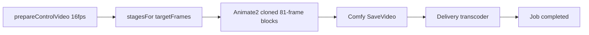

# WAN Animate 2 — implemented

Reference image + driving video via **Wan-Animate-2** as `video2video` / `wan_animate`.

**Depends on:** [../video-media-normalize.plan.md](../video-media-normalize.plan.md)  
**Status board:** [../video-session-status.plan.md](../video-session-status.plan.md)  
**Status:** wired to Animate 2 inbox graph; smoke on render host still open.

## Platform rules (inherited)

1. Shared `prepareControlVideo` — Animate profile `{ targetFps: 16 }` + offset/duration window  
2. Delivery transcoder — job complete only after H.264/AAC MP4 (+faststart); **preserve 16 fps** on output  
3. Callers use `duration_seconds` + `start_offset_seconds`; block math is internal  

## Product surface

- Preset: `wan_animate` — “Wan — Animate 2”
- Required: `input_video_urls[0]`, `input_images[0]`, `prompt`
- Optional: `duration_seconds` (1–15), `start_offset_seconds` (≥0, default 0), `seed`, aspect via 640 table
- Not v1: Mix / SAM2 / PointsEditor

Parked Fun VACE stays commented out. Live video2video: `ltx_ic_lora` + `wan_animate`.

## Animate 2–specific

| Item | Value |
|---|---|
| Source | [`_inbox/video_wan_animate2.json`](../_inbox/video_wan_animate2.json) |
| Nodes | `WanAnimate2ToVideo` + `WanAnimate2Cache` (no DWPose) |
| Weights | `wan_animate_2_int8_convrot.safetensors` |
| Block | 81 frames @ 16 fps; extend overlap 1 |
| Long | Prebaked extend blocks (enable via CreateVideo batch); unused stay unwired |
| Helper | `_wan-animate-duration.js` |

## Implementation checklist

- [x] Adopt Animate 2 API inbox graph (`wan_animate_2.{js,json}`)  
- [x] Register `_index` + `wan_animate` preset + API option + harness fields  
- [x] Wire profile into shared preprocess  
- [x] Clone extend blocks for 12–15s (context windows stay off)  
- [x] Tests: stages / multi-block; requires image+video; Animate2 wiring  
- [ ] Smoke on render host (needs `wan_animate_2_int8_convrot` weights)  

## Later

Mix mode; Director zip; client `output_fps`; scrubber UI for offset.
