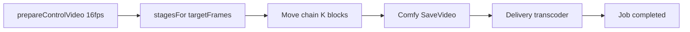

# WAN Animate 2 (Move) — ready to implement

Pose transfer (reference image + control video → video) as `video2video` / `wan_animate`.

**Depends on (do first):** [../video-media-normalize.plan.md](../video-media-normalize.plan.md)  
**Status board:** [../video-session-status.plan.md](../video-session-status.plan.md)  
**Status:** implemented (unit tests); smoke on render host still open.

## Platform rules (inherited)

1. Shared `prepareControlVideo` — Animate profile `{ targetFps: 16 }` + offset/duration window  
2. Delivery transcoder — job complete only after H.264/AAC MP4 (+faststart); **preserve 16 fps** on output  
3. Callers use `duration_seconds` + `start_offset_seconds`; block math is internal  

## Product surface

- Preset: `wan_animate` — “Wan — Animate 2 Move”
- Required: `input_video_urls[0]`, `input_images[0]`, `prompt`
- Optional: `duration_seconds` (1–15), `start_offset_seconds` (≥0, default 0), `seed`, aspect via 640 table
- Not v1: Mix / SAM2 / PointsEditor

Parked Fun VACE stays commented out. Live video2video: `ltx_ic_lora` + `wan_animate`.

## Animate-specific

| Item | Value |
|---|---|
| Source | [`_inbox/video_wan2_2_14B_animate.json`](../_inbox/video_wan2_2_14B_animate.json) |
| Mode | Move — disconnect `background_video` + `character_mask` |
| Block | 77 frames @ 16 fps; `continue_motion_max_frames` = 5 |
| Chain | Max ~4 stages for 15s; enable first K; trim leftovers |
| Helper | `_wan-animate-duration.js` — not VACE `4n+1` |

## Implementation checklist

- [x] Flatten UI→API Move graph + max extend chain  
- [x] Builder `wan2_2_animate_move.js` + JSON  
- [x] Register `_index` + `wan_animate` preset + API option + harness fields  
- [x] Wire profile into shared preprocess  
- [x] Tests: stages 3s/5s/12s/15s; requires image+video; Move wiring  
- [ ] Smoke on render host  

## Later

Mix mode; Director zip; client `output_fps`; scrubber UI for offset.
